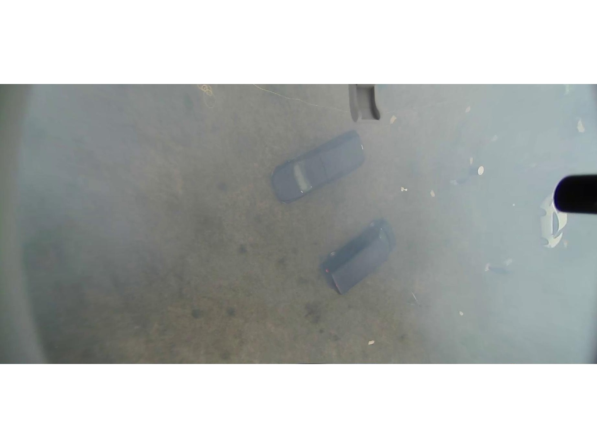
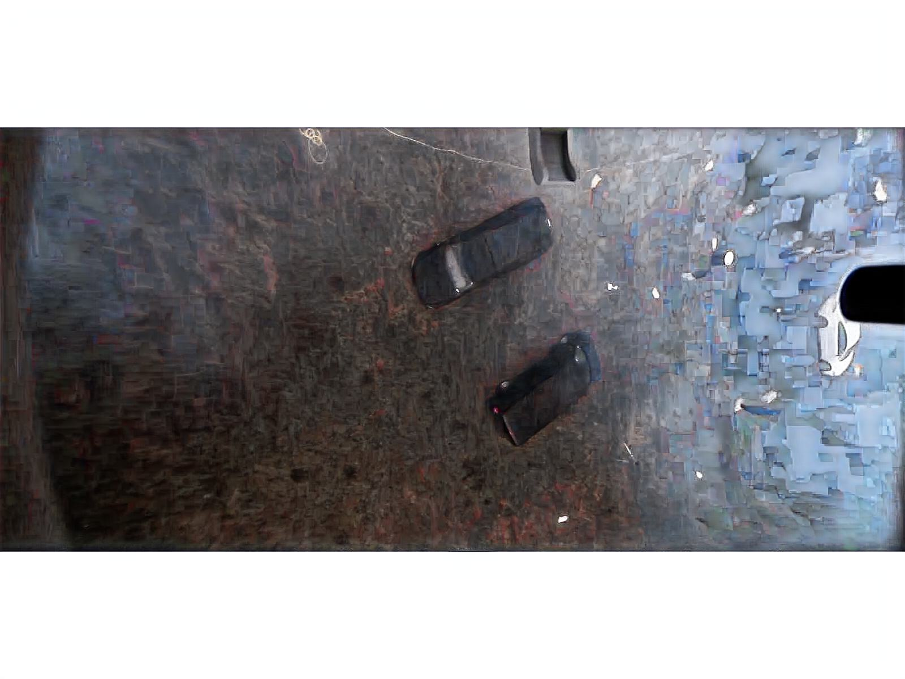

# Repository to host customized AECR-Net model developed as part of [5th UG2+ challenge (CVPR 2022) Track 1.1][https://codalab.lisn.upsaclay.fr/competitions/1235]

## Paper
[Contrastive Learning for Compact Single Image Dehazing, CVPR2021](https://arxiv.org/abs/2104.09367)

## Summary

We modify the [official implementation of AECR-Net](https://github.com/GlassyWu/AECR-Net) to use it's NH_train pretrained model to perform dehazing and provide output images which serves as the input for the object detection task downstream.

We fine tuned the [NH_train  pretrainedmodel](https://github.com/ma08/AECR-Net/blob/6c604b1570e3018ab0f6723e5e4757b404f04d34/trained_models/NH_train.pk) by training it on a subset of the training set available for the competition and obtained [the best model](https://github.com/ma08/AECR-Net/blob/6c604b1570e3018ab0f6723e5e4757b404f04d34/trained_models/NH_train.pk.best) based on evaluation of the remaining subset of the training set.

The results on the finetuned model are not satisfactory and it is found the DW-GAN performs better for the dehazing task.

### Sample 

